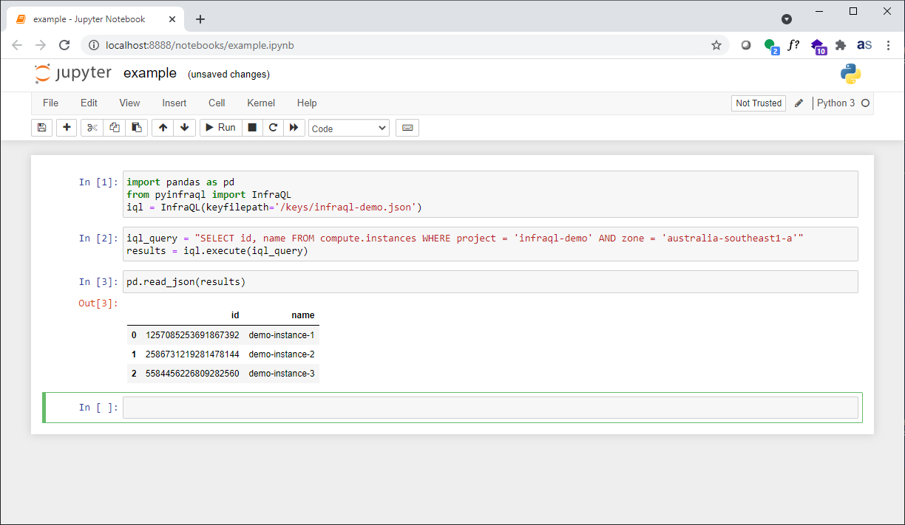

# InfraQL Jupyter Demo

> __*This repository has been archived.  The active project is now located at [StackQL Jupyter Demo](https://github.com/stackql/stackql-jupyter-demo)*__

Query cloud inventory and perform analysis and visualisations using Jupyter and Python.

## Prerequisites

- Docker

## Instructions

1. Clone this repo `git clone https://github.com/infraql/infraql-jupyter-demo`
2. Add the appropriate service account key for your environment to the `keys/` directory 
3. Build the image:
```shell
docker build --no-cache -t infraql-jupyter-demo .
```
4. Run the image:
```shell
docker run -dp 8888:8888 infraql-jupyter-demo start-notebook.sh --NotebookApp.token=''
```
> Add authentication if running this on a server which is accessible to others, see https://jupyter-notebook.readthedocs.io/en/stable/security.html
5. Run your InfraQL commands!
6. Stop your running container when finished:
```shell
docker stop $(docker ps -l -q --filter status=running --filter ancestor=infraql-jupyter-demo)
```

## Example

